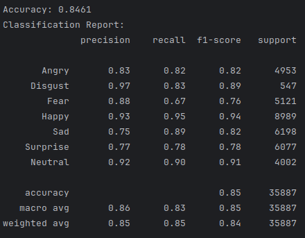
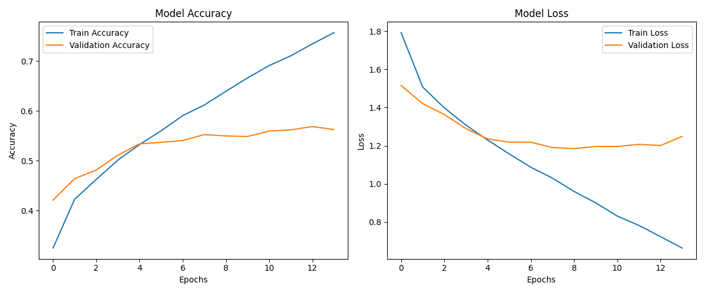
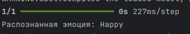
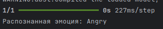
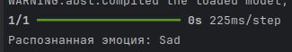

# Распознавание эмоций по изображениям с использованием deep learning

Цель данного проекта — научиться определять эмоции человека по изображению лица,
отнеся их к одной из семи категорий, с использованием глубоких сверточных нейронных сетей.

## Теория

Распознавание эмоций по изображениям с использованием сверточных нейронных сетей (CNN) основывается на их способности автоматически выявлять паттерны в данных. CNN — это особый тип нейронной сети, который эффективно работает с изображениями благодаря своей структуре.

### Как работают сверточные сети
CNN состоит из нескольких слоев, каждый из которых выполняет свою задачу:
- **Свертки** помогают находить простые признаки, такие как края или текстуры, а затем объединяют их для распознавания более сложных паттернов, например, формы глаз или рта.
- **Пулинг** уменьшает размер данных, сохраняя только важную информацию, что снижает нагрузку на сеть и уменьшает риск переобучения.
- **Полносвязные слои** используют найденные признаки для классификации изображений, то есть определяют, какую эмоцию выражает лицо.

Сверточные сети идеально подходят для анализа мимики лица, так как они могут обрабатывать изображения разного качества, ракурсов и освещения. В отличие от традиционных методов, где нужно вручную задавать признаки (например, положение бровей), CNN автоматически обучается выявлять ключевые элементы.

Для обучения модели данные предварительно обрабатываются:
- Изображения масштабируются до одинакового размера (например, 48×48 пикселей).
- Применяется аугментация данных: добавляются повороты, изменения яркости и другие преобразования, чтобы модель лучше обобщала примеры.
- Если в наборе данных одни эмоции встречаются чаще других, используется балансировка классов.

### Оценка результатов
Качество работы модели оценивается с помощью метрик:
- **Accuracy** показывает долю правильных ответов.
- **Confusion Matrix** помогает понять, какие эмоции модель путает чаще всего.
- **Precision и Recall** особенно важны, если данные несбалансированы.

CNN позволяют достичь высокой точности в распознавании эмоций благодаря своей способности автоматически извлекать признаки и обрабатывать большие объемы данных.

## Подготовка проекта

Ниже приведен список зависимостей, который понадобился для реализации данного проекта:

```text
tensorflow~=2.18.0
numpy~=2.0.2
pandas~=2.2.3
matplotlib~=3.10.1
opencv-python~=4.11.0.86
scikit-learn~=1.6.1
keras~=3.9.0
seaborn~=0.13.2
tqdm~=4.67.1
```

1. **`tensorflow~=2.18.0`**: Библиотека TensorFlow используется для создания, обучения и тестирования нейронных сетей, включая сверточные нейронные сети (CNN), которые являются основой модели распознавания эмоций.

2. **`numpy~=2.0.2`**: Библиотека NumPy обеспечивает эффективную работу с числовыми данными и матричными операциями, что критически важно для обработки изображений и выполнения вычислений в машинном обучении.

3. **`pandas~=2.2.3`**: Pandas используется для загрузки, анализа и предварительной обработки данных, таких как работа с CSV-файлами или структурирование меток и путей к изображениям.

4. **`matplotlib~=3.10.1`**: Matplotlib помогает визуализировать данные и результаты работы модели, например, строить графики точности и потерь во время обучения.

5. **`opencv-python~=4.11.0.86`**: OpenCV применяется для обработки изображений, включая изменение размера, нормализацию и аугментацию данных, необходимых для подготовки входных изображений.

6. **`scikit-learn~=1.6.1`**: Scikit-learn предоставляет инструменты для оценки модели, такие как разделение данных на обучающую и тестовую выборки, а также расчет метрик (accuracy, confusion matrix и др.).

7. **`keras~=3.9.0`**: Keras (часть TensorFlow) упрощает создание и обучение нейронных сетей благодаря высокоуровневому API, что делает разработку модели более удобной и быстрой.

8. **`seaborn~=0.13.2`**: Seaborn используется для создания более сложных и информативных визуализаций, таких как тепловые карты confusion matrix или распределение классов в наборе данных.

9. **`tqdm~=4.67.1`**: Tqdm позволяет отображать прогресс выполнения длительных операций, таких как обработка изображений или обучение модели, что улучшает пользовательский опыт при работе с кодом.

Также нам необходимо заранее установить датасет, который будет использоваться для обучения нашей модели.
Для обучения модели был использован набор данных [FER](https://www.kaggle.com/datasets/aadityasinghal/facial-expression-dataset/data).
Этот датасет содержит 35 887 черно-белых изображений размером 48×48 пикселей, каждое из которых представляет лицо человека с одной из семи эмоций:
гнев, отвращение, страх, радость, нейтральность, грусть и удивление.

## Структура проекта


**data/** - папка, содержащая датасет  
**imgs/** - папка, в которой расположены картинки, которые можно использовать в качестве проверки работы модели  
**models/** - папка, хранящая в себе обученные модели  
**utils/** - содержит в себе способствующие функции  
**predict.py** - файл, содержащий логику запуска модели и определения эмоции для переданного изображения  
**test_model.py** - файл, содержащий в себе описание логики тестирования модели и вывода ее метрик  
**train.py** - файл, содержащий в себе логику создания, компиляции и описания модели  

## Архитектура решения

Хотелось бы поподробнее остановиться на архитектуре нашей модели:

```text
model = Sequential()

# Convolutional layers
model.add(Conv2D(128, kernel_size=(3, 3), activation='relu', input_shape=input_shape))  # First convolutional layer
model.add(MaxPooling2D(pool_size=(2, 2)))  # Max pooling to reduce spatial dimensions
model.add(Dropout(0.4))  # Dropout for regularization

model.add(Conv2D(256, kernel_size=(3, 3), activation='relu'))  # Second convolutional layer
model.add(MaxPooling2D(pool_size=(2, 2)))
model.add(Dropout(0.4))

model.add(Conv2D(512, kernel_size=(3, 3), activation='relu'))  # Third convolutional layer
model.add(MaxPooling2D(pool_size=(2, 2)))
model.add(Dropout(0.4))

model.add(Conv2D(512, kernel_size=(3, 3), activation='relu'))  # Fourth convolutional layer
model.add(MaxPooling2D(pool_size=(2, 2)))
model.add(Dropout(0.4))

model.add(Flatten())  # Flatten the feature maps into a 1D vector

# Fully connected layers
model.add(Dense(512, activation='relu'))  # First dense layer
model.add(Dropout(0.4))
model.add(Dense(256, activation='relu'))  # Second dense layer
model.add(Dropout(0.3))

# Output layer
model.add(Dense(output_class, activation='softmax'))  # Output layer with softmax activation
```

1. **Conv2D (128 фильтров, 3x3):** Первый сверточный слой извлекает базовые признаки изображения, такие как края, текстуры и простые паттерны.
2. **MaxPooling2D (2x2):** Уменьшает пространственные размеры данных, сохраняя ключевые признаки и снижая вычислительную сложность.
3. **Dropout (0.4):** Случайным образом отключает 40% нейронов для предотвращения переобучения.

4. **Conv2D (256 фильтров, 3x3):** Второй сверточный слой выявляет более сложные признаки, такие как комбинации краев и формы объектов.
5. **MaxPooling2D (2x2):** Дальнейшее уменьшение размерности данных для повышения эффективности модели.
6. **Dropout (0.4):** Продолжает регуляризацию, отключая 40% нейронов.

7. **Conv2D (512 фильтров, 3x3):** Третий сверточный слой фокусируется на еще более сложных комбинациях признаков, таких как детали лица и выражения.
8. **MaxPooling2D (2x2):** Снижает размерность данных, сохраняя наиболее значимые признаки.
9. **Dropout (0.4):** Регуляризация для борьбы с переобучением.

10. **Conv2D (512 фильтров, 3x3):** Четвертый сверточный слой извлекает высокоуровневые признаки, специфичные для задачи классификации эмоций.
11. **MaxPooling2D (2x2):** Завершающее уменьшение размерности данных.
12. **Dropout (0.4):** Поддерживает регуляризацию модели.

13. **Flatten:** Преобразует многомерные данные в одномерный вектор, готовый для подачи в полносвязные слои.

14. **Dense (512 нейронов, ReLU):** Первый полносвязный слой обрабатывает все извлеченные признаки, формируя высокоуровневое представление данных.
15. **Dropout (0.4):** Продолжает регуляризацию, отключая 40% нейронов.

16. **Dense (256 нейронов, ReLU):** Второй полносвязный слой уточняет представление данных для дальнейшей классификации.
17. **Dropout (0.3):** Менее агрессивная регуляризация, отключающая 30% нейронов.

18. **Dense (output_class нейронов, Softmax):** Выходной слой с функцией активации softmax предсказывает вероятности принадлежности к каждому из `output_class` классов (например, 7 классов эмоций).

Такая архитектура эффективно обрабатывает изображения размером 48x48 пикселей и решает задачу классификации эмоций с высокой точностью.

## Использование

1. **Обучение модели**:
   - Запустите `train.py`, чтобы обучить модель на подготовленном наборе данных.
   - После завершения обучения модель сохраняется в файл (например, `emotion_model.h5`).
   ```bash
   python train.py
   ```

2. **Тестирование модели**:
   - Запустите `test_model.py`, чтобы оценить качество модели на проверочных данных.
   - Результаты тестирования включают графики точности и потерь, а также числовые метрики.
   ```bash
   python test_model.py
   ```

3. **Использование модели**:
   - Запустите `predict.py`, передав путь к изображению. Программа выведет предсказанную эмоцию.
   ```bash
   python predict.py <path_to_image>
   ```

## Результаты

Характеристики нашей самой лучшей обученной модели можно увидеть ниже:


На графике точности (слева) значения по оси Y показывают долю правильных предсказаний модели (от 0 до 1, где 1 = 100% точность).
Синяя линия — это точность на обучающих данных, оранжевая — на проверочных. Чем ближе значения к 1, тем лучше модель работает.

На графике потерь (справа) значения по оси Y показывают величину ошибки модели (чем меньше значение, тем лучше).
Синяя линия — ошибки на обучающих данных, оранжевая — на проверочных. Обычно потери уменьшаются с каждой эпохой, но если они начинают расти на проверочных данных, это признак переобучения. 

Значения на графиках помогают оценить, насколько хорошо модель обучается и обобщает знания.

Далее мы прогнали нашу модель с помощью кода в `test_model.py` на всем датасете (тестовые данные + тренировочные данные),
полученная матрица ошибок ниже:


Также здесь можно увидеть отчет в текстовом формате и полученную accuracy в **84%**



## Эксперименты

Мы перепробовали разные архитектуры для модели. Для нас было возможно получить более высокую accuracy для тренировочных данных:



Однако, как вы можете заметить, validation accuracy оставалась на месте ~ уровне 50%. Когда accuracy на обучающих данных высокая,
но val accuracy (точность на валидационных данных) низкая, это является признаком переобучения модели. Таким образом, модель теряет
способность к обобщению, что значит, что она становится слишком специфичной, не может эффективно работать с новыми данными.

Поэтому мы старались, чтобы не было большого разрыва между двумя этими значениями.

Мы нашли статью о том, какой же accuracy считается допустимым для определения машиной эмоции.
> How good is AI at detecting human emotions from facial expressions? Currently, the most advanced and state-of-the-art FER software can achieve an accuracy rate of around 75% to 80%. This should be compared to the average natural human ability to detect emotions, which is around 90%. It’s important to note that even humans are not infallible when it comes to recognizing and interpreting facial expressions.

[Ссылка на статью](https://www.morphcast.com/blog/accuracy-facial-emotion-recognition-fer/)

Мы проверили также нашу модель на картинках, которых совсем нет в датасете.


Result:




Result:




Result:



