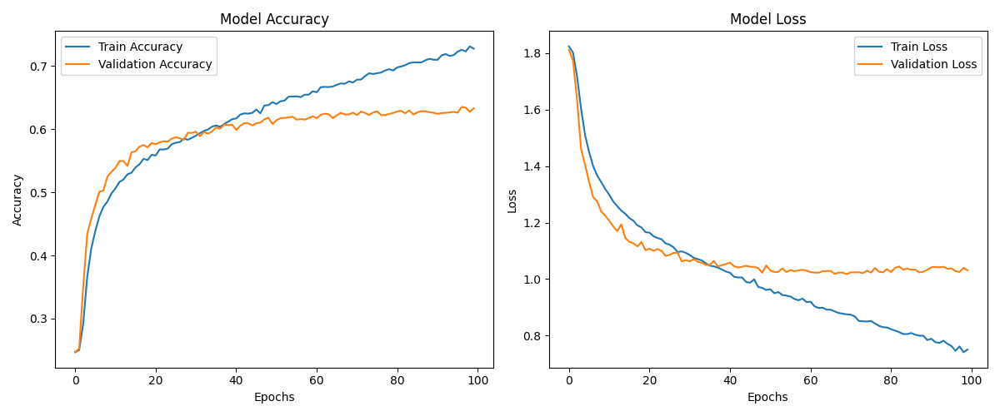

# Распознавание эмоций по изображениям с использованием deep learning

Цель данного проекта — научиться определять эмоции человека по изображению лица,
отнеся их к одной из семи категорий, с использованием глубоких сверточных нейронных сетей.

## Теория

Распознавание эмоций по изображениям с использованием сверточных нейронных сетей (CNN) основывается на их способности автоматически выявлять паттерны в данных. CNN — это особый тип нейронной сети, который эффективно работает с изображениями благодаря своей структуре.

### Как работают сверточные сети
CNN состоит из нескольких слоев, каждый из которых выполняет свою задачу:
- **Свертки** помогают находить простые признаки, такие как края или текстуры, а затем объединяют их для распознавания более сложных паттернов, например, формы глаз или рта.
- **Пулинг** уменьшает размер данных, сохраняя только важную информацию, что снижает нагрузку на сеть и уменьшает риск переобучения.
- **Полносвязные слои** используют найденные признаки для классификации изображений, то есть определяют, какую эмоцию выражает лицо.

Сверточные сети идеально подходят для анализа мимики лица, так как они могут обрабатывать изображения разного качества, ракурсов и освещения. В отличие от традиционных методов, где нужно вручную задавать признаки (например, положение бровей), CNN автоматически обучается выявлять ключевые элементы.

Для обучения модели данные предварительно обрабатываются:
- Изображения масштабируются до одинакового размера (например, 48×48 пикселей).
- Применяется аугментация данных: добавляются повороты, изменения яркости и другие преобразования, чтобы модель лучше обобщала примеры.
- Если в наборе данных одни эмоции встречаются чаще других, используется балансировка классов.

### Оценка результатов
Качество работы модели оценивается с помощью метрик:
- **Accuracy** показывает долю правильных ответов.
- **Confusion Matrix** помогает понять, какие эмоции модель путает чаще всего.
- **Precision и Recall** особенно важны, если данные несбалансированы.

CNN позволяют достичь высокой точности в распознавании эмоций благодаря своей способности автоматически извлекать признаки и обрабатывать большие объемы данных.

## Подготовка проекта

Ниже приведен список зависимостей, который понадобился для реализации данного проекта

```text
tensorflow~=2.18.0
numpy~=2.0.2
pandas~=2.2.3
matplotlib~=3.10.1
opencv-python~=4.11.0.86
scikit-learn~=1.6.1
keras
seaborn~=0.13.2
```

1. **`tensorflow~=2.18.0`**: Библиотека TensorFlow используется для создания, обучения и тестирования нейронных сетей, включая сверточные нейронные сети (CNN), которые лежат в основе модели распознавания эмоций.

2. **`numpy~=2.0.2`**: Библиотека NumPy обеспечивает эффективную работу с числовыми данными и матричными операциями, что критически важно для обработки изображений и выполнения вычислений в машинном обучении.

3. **`pandas~=2.2.3`**: Pandas используется для загрузки, анализа и предварительной обработки данных, таких как работа с CSV-файлами набора данных FER-2013.

4. **`matplotlib~=3.10.1`**: Matplotlib помогает визуализировать данные и результаты работы модели, например, строить графики точности и потерь во время обучения.

5. **`opencv-python~=4.11.0.86`**: OpenCV применяется для обработки изображений, включая изменение размера, нормализацию и аугментацию данных, необходимых для подготовки входных изображений.

6. **`scikit-learn~=1.6.1`**: Scikit-learn предоставляет инструменты для оценки модели, такие как разделение данных на обучающую и тестовую выборки, а также расчет метрик (accuracy, confusion matrix и др.).

7. **`keras`**: Keras (часть TensorFlow) упрощает создание и обучение нейронных сетей благодаря высокоуровневому API, что делает разработку модели более удобной и быстрой.

8. **`seaborn~=0.13.2`**: Seaborn используется для создания более сложных и информативных визуализаций, таких как тепловые карты confusion matrix или распределение классов в наборе данных.

Также нам необходимо заранее установить датасет, который будет использоваться для обучения нашей модели.
Для обучения модели был использован набор данных [FER-2013](https://www.kaggle.com/datasets/nicolejyt/facialexpressionrecognition).
Этот датасет содержит 35 887 черно-белых изображений размером 48×48 пикселей, каждое из которых представляет лицо человека с одной из семи эмоций:
гнев, отвращение, страх, радость, нейтральность, грусть и удивление.

## Структура проекта


**data/** - папка, содержащая датасет `fer2013.csv`  
**imgs/** - папка, в которой расположены картинки, которые можно использовать в качестве проверки работы модели  
**models/** - папка, хранящая в себе обученные модели  
**utils/** - содержит в себе способствующие функции  
**predict.py** - файл, содержащий логику запуска модели и определения эмоции для переданного изображения  
**test_model.py** - файл, содержащий в себе описание логики тестирования модели и вывода ее метрик  
**train.py** - файл, содержащий в себе логику создания, компиляции и описания модели  

## Архитектура решения

Хотелось бы поподробнее остановиться на архитектуре нашей модели:

```text
model = Sequential()

# Первый сверточный блок
model.add(Conv2D(16, (3, 3), activation='relu', input_shape=(48, 48, 1)))
model.add(MaxPooling2D(pool_size=(2, 2)))

# Второй сверточный блок
model.add(Conv2D(32, (3, 3), activation='relu'))
model.add(MaxPooling2D(pool_size=(2, 2)))

# Полносвязные слои
model.add(Flatten())
model.add(Dense(128, activation='relu'))
model.add(Dense(7, activation='softmax'))  # 7 классов эмоций
```
1. **Conv2D (16 фильтров, 3x3):** Извлекает простые признаки (края, текстуры) из изображения.
2. **MaxPooling2D (2x2):** Уменьшает размерность данных, сохраняя ключевые признаки.
3. **Conv2D (32 фильтра, 3x3):** Выявляет более сложные признаки (комбинации краев, формы).
4. **MaxPooling2D (2x2):** Дальнейшее уменьшение размерности для снижения вычислительной сложности.
5. **Flatten:** Преобразует многомерные данные в одномерный вектор для полносвязных слоев.
6. **Dense (128 нейронов, ReLU):** Обрабатывает все извлеченные признаки для создания высокоуровневого представления.
7. **Dense (7 нейронов, Softmax):** Предсказывает вероятности принадлежности к 7 классам эмоций.

Такая архитектура эффективно обрабатывает изображения размером 48x48 пикселей и решает задачу классификации эмоций.

## Использование

1. **Обучение модели**:
   - Запустите `train.py`, чтобы обучить модель на подготовленном наборе данных.
   - После завершения обучения модель сохраняется в файл (например, `emotion_model.h5`).
   ```bash
   python train.py
   ```

2. **Тестирование модели**:
   - Запустите `test_model.py`, чтобы оценить качество модели на проверочных данных.
   - Результаты тестирования включают графики точности и потерь, а также числовые метрики.
   ```bash
   python test_model.py
   ```

3. **Использование модели**:
   - Запустите `predict.py`, передав путь к изображению. Программа выведет предсказанную эмоцию.
   ```bash
   python predict.py <path_to_image>
   ```

## Результаты

Характеристики нашей самой лучшей обученной модели можно увидеть ниже:



На графике точности (слева) значения по оси Y показывают долю правильных предсказаний модели (от 0 до 1, где 1 = 100% точность).
Синяя линия — это точность на обучающих данных, оранжевая — на проверочных. Чем ближе значения к 1, тем лучше модель работает.

На графике потерь (справа) значения по оси Y показывают величину ошибки модели (чем меньше значение, тем лучше).
Синяя линия — ошибки на обучающих данных, оранжевая — на проверочных. Обычно потери уменьшаются с каждой эпохой, но если они начинают расти на проверочных данных, это признак переобучения. 

Значения на графиках помогают оценить, насколько хорошо модель обучается и обобщает знания.

Далее мы прогнали нашу модель с помощью кода в `test_model.py` на этом же датасете, полученная матрица ошибок ниже:


Вот отчет, которы

